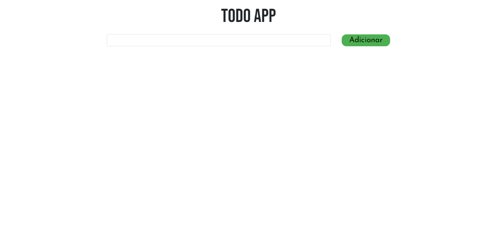
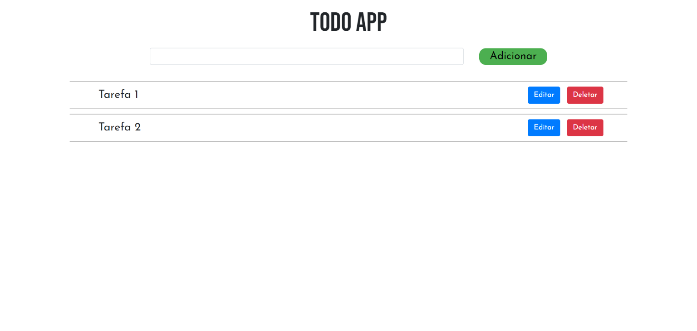
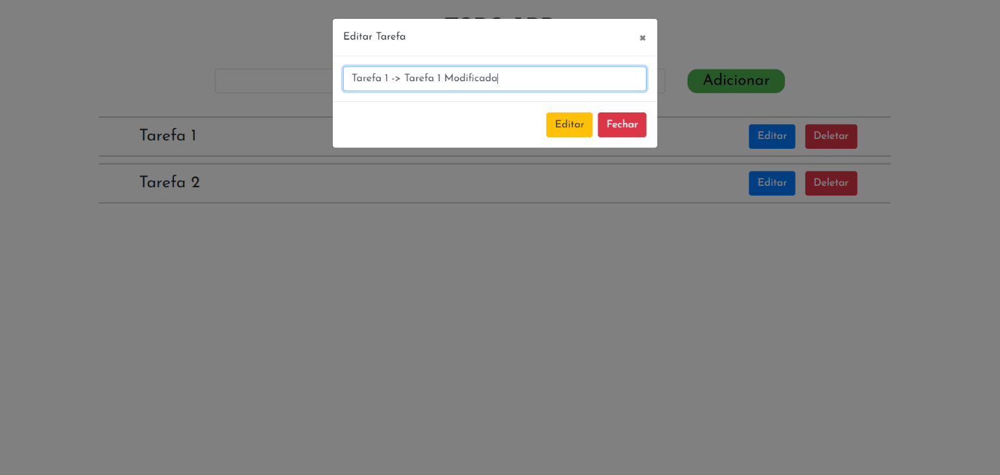
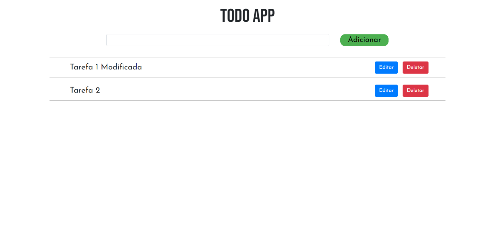

# TODO APP CRUD

Esta aplicação do tipo "TODO List", foi construída com a Stack React | Node | PostgreSQL | Express. O foco era aprender como realizar um CRUD e construir uma API, envolvendo somente JavaScript e o banco Postgres.

## Instalando Dependências

- Para utilizar o projeto é necessário possuir o banco de dados PostgreSQL versão 13.2 ou superior
- Node versão 14.17.5 ou superior

## Utilização

Primeiro é necessário clonar este repositório

`git clone https://github.com/zipluciano/CRUD-todo.git`

Tanto na pasta `./server` quanto `./client` executar o comando `npm install` para baixar as dependências do projeto.

Para utilizar a aplicação basta rodar o comando `npm start` tanto no pasta `./server` como `./client`

## App

#### Home Page

#### Tarefas existentes

#### Edição de tarefas

#### Tarefas editadas

